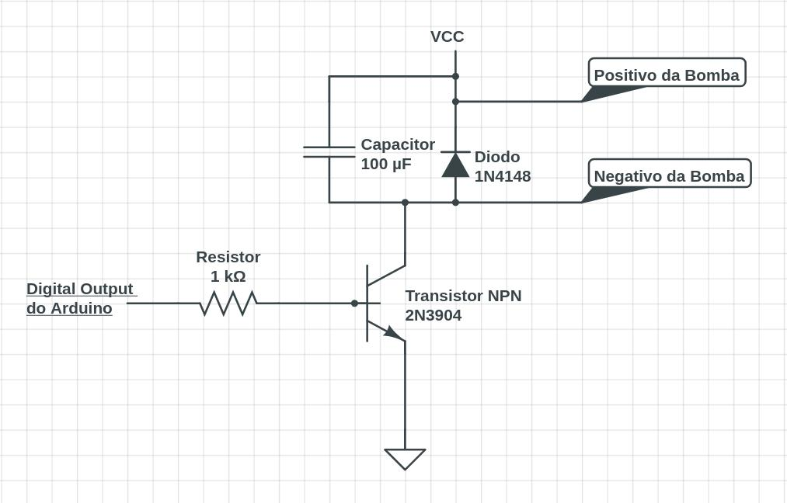

# AquaRobbie

Projeto inspirado no Hydrabot desenvolvido em lives no canal [**Julialabs**](https://www.twitch.tv/julialabs) na Twitch.
[Clique aqui para ver o projeto do Hydrabot](https://github.com/Juliallabs/hydrabot).

## Diferenças entre o Hydrabot e o AquaRobbie

O Hydrabot é um dispositivo IOT que permite que um copo de água seja enviado para a Julia durante suas lives através do resgate de uma _Hidratação com Grande Estilo_, desenvolvido no plataform.io com o ESP32.
O AquaRobbie é um projeto mais simples, utilizando arduino para hidratar seu utilizador em determinados períodos de tempo, ou de acordo com o pedido do usuário.

## Materiais necessários

- Bomba de aquário;
- LED para representar a bomba no processo de desenvolvimento;
- Sensor de toque capacitivo (pode ser substituido por um botão);
- Sensor de distância ultrassônico;
- LEDs RBG;
- Soundbuzzer.

## Bibliotecas usadas

#### Ultrassonic

Biblioteca utilizada para controlar o sensor de distância ultrassônico e obter a distância em centímetros. [Clique aqui para acessar a biblioteca](https://github.com/evsystems/ultrasonic/blob/master/Ultrasonic.h).

#### Dlacolor

Biblioteca utilizada para controlar os LEDs RBG. [Clique aqui para acessar a biblioteca](https://github.com/guilhermeoliveiralopes/dlacolor).

## Como funciona

Uma vez ligado, o projeto é ativado em intervalos de tempo definidos na contante _INTERVALO_ definida em milissegundos dentro do programa ([acesse este link para um conversor de medidas](http://extraconversion.com/pt/tempo/minutos/minutos-para-milissegundos.html)). O usuário também pode solicitar água ativando o sensor capacitivo, o que reseta a contagem de intervalo de tempo. Um sensor de distância monitora de o copo está ou não na posição correta, e um LED indica quando o copo está no lugar.
Quando a hidratação é ativada, um buzzer avisa que a água está disponível. LEDs RBG também são utilizados para fins estéticos.
No momento, toda a estrutura está montada em uma caixa de papelão.

## Conexões da bomba de aquário

A bomba de aquário deve ser ligada através de uma fonte externa, para garantir a segurança e o bom funcionamento do circuito, já que a quantidade de energia que ela requere pode danificar o arduino. O circuito montado está disponível na imagem abaixo.
.

#### Funcionamento dos componentes

- Resistor de 1K - Garante que o transistor funcionará em modo de saturação. Este componente faz a conexão entre o arduino e este circuito externo;
- Transistor NPN - Responsável pela ativação ou não da bomba de aquário, atuando como uma chave. Quando um valor 0 é inserido na base, é como se o coletor e o emissor não se comunicassem, de modo que não há corrente. Quando a base é alimentada com um sinal 1, o circuito entre o coletor e o emissor é fechado, fazendo com que haja corrente entre o VCC e o GND da fonte;
- Bomba de aquário: O principal atuante do circuito;
- Diodo : Responsável por garantir uma saída segura para o recuo indutivo do motor;
- Capacitor : reduz a velocidade das transições de tensão no motor.

Para mais informações veja [este video do canal WRKits sobre transistores](https://www.youtube.com/watch?v=yyrw22qEMJc) ou [este artigo explicando a necessidade do diodo e do capacitor.](https://qastack.com.br/electronics/95140/purpose-of-the-diode-and-capacitor-in-this-motor-circuit#:~:text=Um%20pequeno%20capacitor%20do%20outro,qual%20o%20transistor%20está%20sujeito.&text=O%20transistor%20BE%20parece%20um,a%20750%20mV%20ou%20mais.)
**Acesse a pasta imagens_e_videos para ver mais sobre o projeto**
