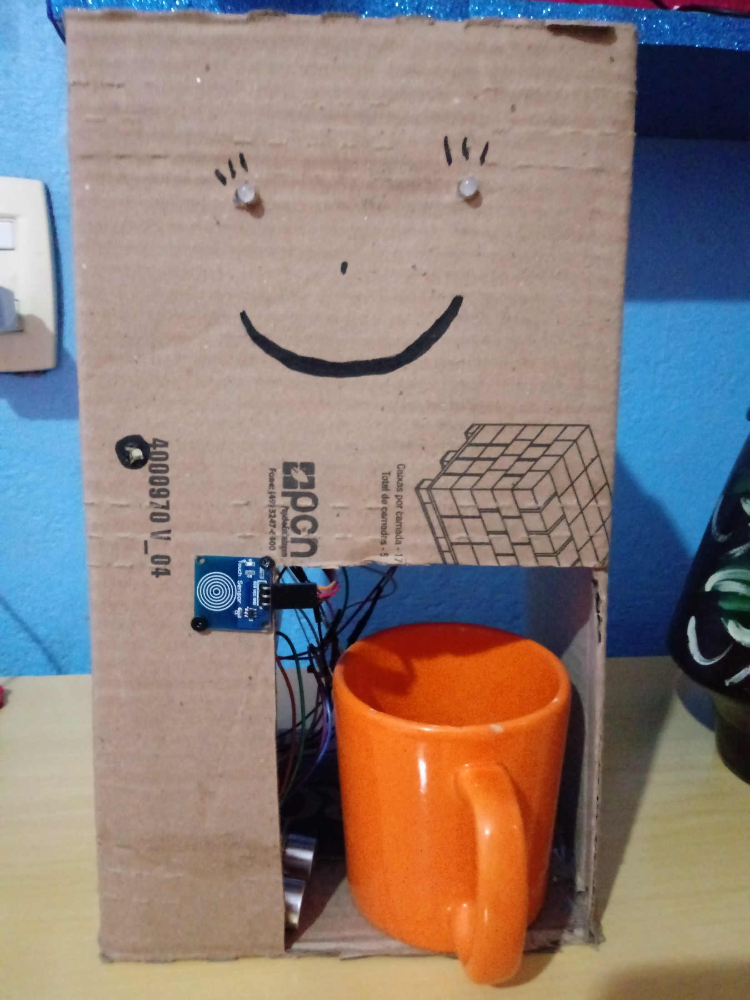

# AquaRobbie

Projeto inspirado no Hydrabot desenvolvido em lives no canal [**Julialabs**](https://www.twitch.tv/julialabs) na Twitch.
[Clique aqui para ver o projeto do Hydrabot](https://github.com/Juliallabs/hydrabot)

## Diferenças entre o Hydrabot e o AquaRobbie
O Hydrabot é um dispositivo IOT que permite que um copo de água seja enviado para a Julia durante suas lives através do resgate de uma *Hidratação com Grande Estilo*, desenvolvido no plataform.io com o ESP32.
O AquaRobbie é um projeto mais simples, utilizando arduino para hidratar seu utilizador em determinados períodos de tempo, ou de acordo com o pedido do usuário.

## Materiais necessários
* Bomba de aquário;
* LED para representar a bomba no processo de desenvolvimento;
* Sensor de toque capacitivo (pode ser substituido por um botão);
* Sensor de distância ultrassônico;
* LEDs RBG;
* Soundbuzzer. 

## Bibliotecas usadas
#### Ultrassonic
Biblioteca utilizada para controlar o sensor de distância ultrassônico e obter a distância em centímetros. [Clique aqui para acessar a biblioteca](https://github.com/evsystems/ultrasonic/blob/master/Ultrasonic.h).

#### Dlacolor
Biblioteca utilizada para controlar os LEDs RBG. [Clique aqui para acessar a biblioteca](https://github.com/guilhermeoliveiralopes/dlacolor).

## Como funciona
Uma vez ligado, o projeto é ativado em intervalos de tempo definidos na contante *INTERVALO* dentro do programa. O usuário também pode solicitar água ativando o sensor capacitivo, o que reseta a contagem de intervalo de tempo. Um sensor de distância monitora de o copo está ou não na posição correta, e um LED indica quando o copo está no lugar. 
Quando a hidratação é ativada, um buzzer avisa que a água está disponível. LEDs RBG também são utilizados para fins estéticos. 
Toda a estrutura é montada em uma caixa de papelão.
